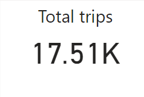

# Bike_share_analysis
Cyclistics bike share project with R and Power BI

   

 

##### STEP 1: I imported the data

##### STEP 2: Wrangle data by checking them for incontegencies and also cobined the into a single file.

##### STEP 3: Cleaned the data in preparation for analysis

##### STEP 4: Descriptive analysis and visualization

##### STEP 5: Recommendations

## More Visuals with Power Bi

## Observations:

Based on my analysis, it is clear that the majority of the trips are taken by casual riders, while members take a much smaller number of trips. 

However, it is also evident that members tend to take trips more consistently throughout the week, while casual riders tend to take more trips on weekends.

## Recommendations:

* To convert casual riders into members, Cyclistics could consider offering incentives or discounts to casual riders who frequently use the service.
 This could be done by providing them with an opportunity to become members at a reduced rate or providing them with exclusive offers that are not available to casual  riders.

* Another approach could be to highlight the benefits of becoming a member, such as lower per-ride costs, faster and easier checkouts, and access to exclusive features.

* Cyclistics could also consider offering different membership tiers, with varying benefits and prices, to cater to a wider range of customers.

* Overall, the key to converting casual riders into members is to make the membership program attractive and accessible to a wide range of customers, and to communicate its value clearly and effectively.

            

